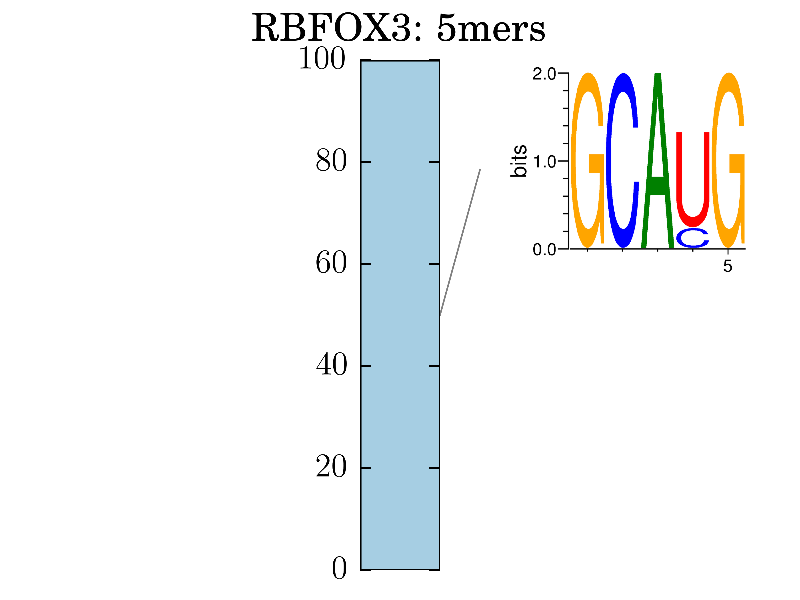

***

Welcome to the repository for RNA Bind-N-Seq Analysis! 

The RBNS pipeline is a set of bioinformatics tools to analyze data from high-throughput sequencing experiments of protein-bound RNAs.

## Installation

##### Requirements

The RBNS pipeline is designed to run on Linux. In addition, it requires the following software to be pre-installed on your computing environment:

- Python (tested on version 2.7.11)
- The [Miniconda](https://conda.io/miniconda.html) or [anaconda](https//docs.anaconda.com/) package manager
- The [forgi](https://viennarna.github.io/forgi/) library.
- The [Weblogo](http://weblogo.threeplusone.com/manual.html) program
- The [RNAfold](https://www.tbi.univie.ac.at/RNA/) program

If you need help installing any of these tools, see the [detailed documentation](docs/installation.md). When installing dependencies, make sure you agree with the corresponding licenses of various software tools.

## Download and install the RBNS_pipeline

The easiest way to get the RBNS pipeline software is to clone our repository. This will ensure you always have access to the latest version. 

	git clone git@bitbucket.org:pfreese/rbns_pipeline.git

After cloning our repository, run the included installation script: 

	cd rbns_pipeline
	./install.sh

This will use the Conda package manager to ensure that you have all of the key dependencies. This step will create a stable environment in which to run analysis jobs. 
This approach will keep your results reproducible and will not affect other software that you have installed on your system.
While you can also use the RBNS pipeline without this step by installing all necessary packages manually, it is not recommended.

## Test the RBNS pipeline with example data

In this public version, the RBNS_pipeline is able to analyze RBNS (Lambert et al., 2014) data. You can find example input files in the test_data/ directory within the repository. These were derived from experiments that assayed the RBFOX3 protein.

If you didn't already download the example file with the installation script, run:

	./test_data/download_files.sh 

Once the script has finished running, you can find the output from the pipeline in the results_dir given in the settings.json file.

### RBNS_pipeline

The inputs to the RBNS_pipeline are described in more detail [here](docs/input_files.md). Here is a quick summary:

- A settings .json file describing the samples.
- A FASTQ file containing the sequencing reads to be analyzed.

You can find examples of all of these files in the test_data/ folder. It is probably easiest to just take a look at these files first. You can run the RBNS_pipeline on this example and reproduce the figures below.

#### Example output: RBFOX3

The complete set of output files is described in . Briefly, output should include:

- Split read files for each library
- Enrichment tables of kmers

Optional output files include:

- SKA library fraction and other tables
- Sequence motif logos as shown below
- RNA secondary structure analyses of the top enriched kmers

An example of an output logo for RBFOX3 is:

## License

RBNS_pipeline is developed by Peter Freese and released under a GPL v3 license.

## Contact

For any questions or comments about SHAPEware, contact Peter Freese (pfreese [at] mit {dot} edu)

## References

- Lambert, et al. **RNA Bind-n-Seq: quantitative assessment of the sequence and structural binding specificity of RNA binding proteins** _Mol Cell_. 2014 Jun 5;54(5):887-900. doi:  [10.1016/j.molcel.2014.04.016](https://www.ncbi.nlm.nih.gov/pubmed/24837674)
- Lambert, et al. **RNA Bind-n-Seq: Measuring the Binding Affinity Landscape of RNA-Binding Proteins** _Methods Enzymol_. 2015 558:465-93. doi:  [10.1016/bs.mie.2015.02.007](https://www.ncbi.nlm.nih.gov/pubmed/26068750)
- Dominguez et al. **Sequence, Structure and Context Preferences of Human RNA Binding Proteins** _bioRxiv_. 2017 Oct 12. doi:  [10.1101/201996](https://www.biorxiv.org/content/early/2017/10/12/201996)

